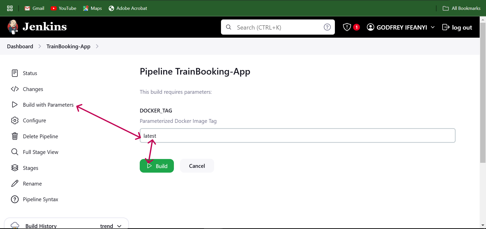

# Jenkins Pipeline Setup Guide for Smart Traffic Switching: A Blue-Green Deployment Solution

This guide will walk you through setting up the Jenkins pipeline from scratch, including initial Jenkins setup, plugin installation, and configuration for Smart Traffic Switching of the Trainbooking application. The pipeline is designed for a Blue-Green Deployment strategy, ensuring seamless updates with minimal downtime.

---

## Prerequisites

1. **Jenkins Installed and Configured**:
   - An EC2 server setup running Jenkins, with Java, Docker, and Trivy installed and accessible over the browser. Kind see **[Infrastructure Setup](https://github.com/Godfrey22152/Smart-Traffic-Switching-A-Blue-Green-Deployment-Solution#infrastructure-setup)** in the project `README` for a detailed guide.
   - Install necessary plugins: `Docker Pipeline`, `Docker`, `Eclipse Temurin Installer`, `SonarQube Scanner`, `Config File Provider`, `Maven Integration`, `Pipeline Maven Integration`, `Kubernetes Credentials`, `Kubernetes CLI`, `Kubernetes Client API`, `Kubernetes` and `Pipeline: Stage View`.

2. **Credentials Setup**:
   - `git-cred`: GitHub credentials to access the repository.
   - `docker-cred`: DockerHub credentials for pushing Docker images.
   - `k8-cred`: Kubernetes Secret credential to access the cluster through service account.
   - `sonar-server`: SonarQube server configuration Token.
   - `email-cred`: Gmail app-password for Email Notification.

3. **[Tools Installed on Jenkins Node](https://github.com/Godfrey22152/Smart-Traffic-Switching-A-Blue-Green-Deployment-Solution/blob/main/README.md#infrastructure-setup)**:
   - Java Development Kit (JDK 17).
   - Maven (version 3 or later).
   - Trivy for scanning filesystem and Docker images.
   - Docker CLI and Kubernetes CLI (`kubectl`).
   - Kind see **[Infrastructure Setup](https://github.com/Godfrey22152/Smart-Traffic-Switching-A-Blue-Green-Deployment-Solution/blob/main/README.md#infrastructure-setup)** in the project `README` for a detailed guide.

4. **[Kubernetes Cluster](https://github.com/Godfrey22152/Smart-Traffic-Switching-A-Blue-Green-Deployment-Solution/blob/main/README.md#cd--eks-cluster-setup)**:
   - A cluster set up with **[Service Account](https://github.com/Godfrey22152/Smart-Traffic-Switching-A-Blue-Green-Deployment-Solution/blob/main/Jenkins_ServiceAccount_RBAC_Scripts)** to allow Jenkins Access.
   - Install Helm for installing Nginx ingress.
   - Install Nginx ingress controller.
       
---
## Complete Kubernetes Cluster Setup

### install helm 
   ```bash
   curl -o /tmp/helm.tar.gz -LO https://get.helm.sh/helm-v3.10.1-linux-amd64.tar.gz
   tar -C /tmp/ -zxvf /tmp/helm.tar.gz
   mv /tmp/linux-amd64/helm /usr/local/bin/helm
   chmod +x /usr/local/bin/helm
   ```

### Install Nginx ingress controller.
   You can find the Kubernetes NGINX documentation **[here](https://kubernetes.github.io/ingress-nginx/)**
   First thing we do is check the compatibility matrix to ensure we are deploying a compatible version of NGINX Ingress on our Kubernetes cluster.

   The Documentation also has a link to the **[GitHub Repo](https://github.com/kubernetes/ingress-nginx/)** which has a compatibility matrix.

 - **Get the installation YAML**
   The controller ships as a `helm` chart, so we can grab version `v1.11.3` as per the compatibility matrix.

   From our container we can do this:

   ```bash
   helm repo add ingress-nginx https://kubernetes.github.io/ingress-nginx
   helm search repo ingress-nginx --versions
   ```

   From the app version we select the version that matches the compatibility matrix.

   ```bash
   NAME                            CHART VERSION   APP VERSION     DESCRIPTION
   ingress-nginx/ingress-nginx     4.11.3          1.11.3          Ingress controller for Kubernetes using NGINX a...
   ```
   Now we can use helm to install the chart directly if we want.
   Or we can use helm to grab the manifest and explore its content.
   We can also add that manifest to our git repo if we are using a GitOps workflow to deploy it.

   ```bash
   CHART_VERSION="4.4.0"
   APP_VERSION="1.5.1"

   mkdir ./nginx-ingress-manifests

   helm template nginx-ingress ingress-nginx \
   --repo https://kubernetes.github.io/ingress-nginx \
   --version ${CHART_VERSION} \
   --namespace ingress-nginx \
   --set controller.service.type=LoadBalancer \
   > ./nginx-ingress-manifests/installation_nginx_ingress.${APP_VERSION}.yaml
   ```
 - **Deploy the Ingress controller**
   ```bash
   kubectl create namespace ingress-nginx
   kubectl apply -f ./nginx-ingress-manifests/installation_nginx_ingress.${APP_VERSION}.yaml
   ```

 - **Check the installation**
   ```bash
   kubectl get pods -n ingress-nginx
   ```
   ```bash
   NAME                                                          READY   STATUS    RESTARTS      AGE
   pod/nginx-ingress-ingress-nginx-controller-6ffbff94df-td7pr   1/1     Running   0             5m
   ```
 - **Check the Nginx Ingress Service**

   ```bash
   kubectl get svc -n ingress-nginx
   NAME                                               TYPE           CLUSTER-IP      EXTERNAL-IP      PORT(S)                      AGE
   nginx-ingress-ingress-nginx-controller             LoadBalancer   10.105.156.69   XXXXXXXXXXXXXX   80:31507/TCP,443:31539/TCP   5m
   nginx-ingress-ingress-nginx-controller-admission   ClusterIP      10.98.183.68    <none>           443/TCP                      5m
   ```
   
---
## Accessing Jenkins and Initial Setup

### 1. Start Jenkins and Access the Web Interface
1. Launch Jenkins on your server or local environment.
2. Open a browser and navigate to `http://<your_server_ip>:8080`.
3. You’ll be prompted to enter the Jenkins initial admin password.

### 2. Retrieve the Initial Admin Password
To get the initial password for Jenkins running in a Docker container, use the command:
```bash
sudo cat /var/jenkins_home/secrets/initialAdminPassword
```
Copy the password and paste it into Jenkins to proceed with the setup.

### 3. Install Plugins:- `Recommended Plugins`
After logging in, Jenkins will prompt you to install plugins. Choose `Install Suggested Plugins` to install common plugins.

#### Additional Required Plugins
To install project-specific plugins:
1. Go to **Manage Jenkins** > **Manage Plugins**.
2. Under the **Available** tab, search for and install these plugins:
   - Docker Pipeline
   - Docker
   - Eclipse Temurin Installer
   - SonarQube Scanner
   - Config File Provider
   - Maven Integration
   - Pipeline Maven Integration
   - Kubernetes
   - Kubernetes Credentials
   - Kubernetes CLI
   - Kubernetes Client API
   - Pipeline: Stage View

### 4. Configuring Global Tool Installations
1. **Java (JDK)**:

- Go to Manage Jenkins > Global Tool Configuration.
- Under `JDK installations`, click `Add JDK` and select `Install automatically`.
- Set the Name to `jdk17`.
- Click `Add Installer` and Select `Install from adoptium.net`from the installation options.
- Scrol to `OpenJDK 17 - HotSpot` under `Version` and choose your preferred version within the top 5 versions of the `OpenJDK 17 - HotSpot`, I chose this version `jdk-17.0.11+9`.
 
2. **Maven**:

- Under `Maven installations`, click Add Maven.
- Set the Name to `maven3` and select Install automatically.

3. **SonarQube Scanner**:

- Under `SonarQube Scanner installations`, click `Add SonarQube Scanner`.
- Set the Name to `sonar-scanner` and select Install automatically.

4. **Docker**:

- Under `Docker installations`, click `Add docker`.
- Set the Name to `docker` and select Install automatically.
- click `Add Installer` and select `Download from docker.com`.
- Docker version should be `latest`

5. **After entering the tools configuration details, click `Apply` and `Save` to close the configuration page**


### 5. Configure your Credentials
- Go to `**Dashboard**` > `**Manage Jenkins**` > `**Credentials**`
- Click on `**(global)**` > `**Add Credentials**` > select `**Kind**` 

    #### Types of Kind to choose for the Credentials
    - For Git Credentials (git-cred) ---> Username with password
    - For SonarQube PAT (sonar-token) ---> Secret text
    - For Docker Credentials (docker-cred) ---> Username with password
    - For K8s Service Account secret (k8-cred) ---> Secret text
    - For Email Credentials (email-cred) ---> Username with password 

- For each `kind` you select provide the credential key details like the `**ID**`, `**Name**` and `**Description**` then proceed to create your Credentials. **(SEE SCREENSHOT IMAGES IN THE SCREENSHOT SECTION)** 


#### Creating Credentials in Jenkins

To securely store credentials in Jenkins, follow these steps for each type of credential required by the pipeline.

##### 1. Git Credentials (`git-cred`) - Username with Password

1. Go to **Dashboard** > **Manage Jenkins** > **Manage Credentials**.
2. Select the appropriate domain **(global)**
3. Click **Add Credentials**.
4. In the **Kind** dropdown, select **Username with password**.
5. Fill in the following fields:
   - **Username**: Enter your Git username.
   - **Password**: Enter your Git password or personal access token.
   - **ID**: Enter `git-cred` (The ID I used in my pipeline).
   - **Description**: Provide a description for easy identification (e.g., "Git Credentials for Pipeline").
6. Click **OK** to save the credential.

##### 2. SonarQube PAT (`sonar-token`) - Secret Text

1. Go to **Dashboard** > **Manage Jenkins** > **Manage Credentials**.
2. Select the appropriate domain  **(global)**
3. Click **Add Credentials**.
4. In the **Kind** dropdown, select **Secret text**.
5. Fill in the following fields:
   - **Secret**: Paste the SonarQube Personal Access Token (PAT) here.
   - **ID**: Enter `sonar-token` (The ID I used in my pipeline).
   - **Description**: Provide a description (e.g., "SonarQube Token for Code Analysis").
6. Click **OK** to save the credential.

##### 3. Docker Credentials (`docker-cred`) - Username with Password

1. Go to **Dashboard** > **Manage Jenkins** > **Manage Credentials**.
2. Select **(global)**) 
3. Click **Add Credentials**.
4. In the **Kind** dropdown, select **Username with password**.
5. Fill in the following fields:
   - **Username**: Enter your Docker Hub username.
   - **Password**: Enter your Docker Hub password or access token.
   - **ID**: Enter `docker-cred` (The ID I used in my pipeline).
   - **Description**: Provide a description (e.g., "Docker Credentials for Pipeline").
6. Click **OK** to save the credential.

##### 4. K8s Service Account Secret (`k8-cred`) - Secret Text

1. Go to **Dashboard** > **Manage Jenkins** > **Manage Credentials**.
2. Select the appropriate domain **(global)** 
3. Click **Add Credentials**.
4. In the **Kind** dropdown, select **Secret text**.
5. Fill in the following fields:
   - **Secret**: Paste the generated Kubernetes Service Account Secret here.
   - **ID**: Enter `k8-cred` (The ID I used in my pipeline).
   - **Description**: Provide a description (e.g., "Kubernetes Service Account Token for Deployment").
6. Click **OK** to save the credential.

##### 5. Email Credentials (`email-cred`) - Username with Password

1. Go to **Dashboard** > **Manage Jenkins** > **Manage Credentials**.
2. Select the appropriate domain **(global)**
3. Click **Add Credentials**.
4. In the **Kind** dropdown, select **Username with password**.
5. Fill in the following fields:
   - **Username**: Enter your email service Email address.
   - **Password**: Enter your email service `**app passwords**`.
   - **ID**: Enter `email-cred` (The ID I used in my pipeline).
   - **Description**: Provide a description (e.g., "Email Credentials for Jenkins Notifications").
6. Click **OK** to save the credential.

**NOTE**:
You are expected to generate google app passwords for the GMAIL Email Notification. This app password is what you are expected to use to create Email credentials and not your real Email password. Here is how to generate one: 
- Go to `https://myaccount.google.com/apppasswords`
- Provide an `App Name` which can be any name and click `Create` to generate app password.
- Copy app password and use it to create your Email credential (email-cred), also use it as password for E-mail Notification.

This completes the credential setup in Jenkins for Git, SonarQube, Docker, Kubernetes, and Email. Each credential ID will be referenced in the pipeline stages as needed.


### 6. Config File Management
- Go to `**Dashboard**` > `**Manage Jenkins**` > `**Managed files**`
- Click on `Add a new config` and select `Global Maven settings.xml`
- Scroll down to the buttom of the page and find `ID` ID of the config file.
- Clear the content of the `ID` and enter `maven-settings`, then click `Next`
- scroll down to `**Server Credentials**` > `**Content**` then scroll the `content` box to find `servers` section.
- Uncomment the server section in the content box and add your Nexus  server credential details: 

```bash
    <server>
      <id>maven-releases</id>
      <username>admin</username>
      <password>odo</password>
    </server>
    
    <server>
      <id>maven-snapshots</id>
      <username>admin</username>
      <password>odo</password>
    </server>
```

#### NOTE
In this step, we set up a global Maven settings.xml file to manage credentials securely for our Maven repository (e.g., Nexus). By defining this configuration in Jenkins, we ensure that the pipeline can access the repository with appropriate credentials without hard-coding sensitive information into the pipeline script. This also allows centralized management of configuration files, making it easier to update and maintain. Additionally, by specifying credentials under Server Credentials, we can manage multiple environments (such as maven-releases and maven-snapshots) and ensure the correct permissions are applied when Jenkins interacts with these repositories. **(SEE SCREENSHOT IMAGES IN THE SCREENSHOT SECTION)**


### 7. Configure SonarQube servers

- Go to `**Dashboard**` > `**Manage Jenkins**` > `**System**` > `**SonarQube servers**`
- Click `Add SonarQube` and provide the following: 
    - Name as:  `sonar-server`
    - Server URL with your SonarQube server URL: `http://<Public-IP>:9000`
    - Server authentication token: Your Generated SonarQube PAT and added as a credential in my case `sonar token.`


#### How to Generate SonarQube Personal Access Token (PAT) from your SonarQube Server:
- While logged-in in your SonarQube server, locate and click `**Administration**` at the top of the page.
- Under the `**Administration**` page, select `**Security**` > `**Users**` > `**Tokens**` to generate token.
- Click the box under the `Tokens` section to generate token.
- Enter token name in my case: `sonar-token`, generate and copy the token to a safe place.
- Create a credential following the steps mentioned in the credentials section above to create the SonaQube Server authentication token afterwards, you will add the generated PAT as a secret text. **(SEE SCREENSHOT IMAGES IN THE SCREENSHOT SECTION)**


### 8. Configure Email Notification and Extended E-mail Notification 

- Go to `**Dashboard**` > `**Manage Jenkins**` > `**System**` > Find `**Extended E-mail Notification**` and `**Email Notification**` 
- Fill in the Forms as shown in the screenshoots below to configure both `**Extended E-mail Notification**` and `**Email Notification**`. 

#### Extended E-mail Notification and E-mail Notification configuration

##### Extended E-mail Notification configuration


##### E-mail Notification configuration


- After setting up `E-mail Notification` click the button below `**Test configuration by sending test e-mail**`

##### NOTE:
You are expected to generate google app passwords for the GMAIL Email Notification. This app password is what you are expected to use to create Email credentials and not your real Email password. Here is how to generate one: 
- Go to `https://myaccount.google.com/apppasswords`
- Provide an `App Name` which can be any name and click `Create` to generate app password.
- Copy app password and use it to create your Email credential (email-cred), also use it as password for E-mail Notification.

---

## Setting Up the Jenkins Pipeline

### 1. Create a New Pipeline
1. From the Jenkins dashboard, click on **New Item**.
2. Enter a name for your pipeline `Smart-Traffic-Switching-A-Blue-Green-Deployment` and select **Pipeline**. Click **OK**.

### 2. Configure the Pipeline Script 
1. In the pipeline configuration page, scroll to **Discard old builds**, select the number of **Days to keep builds**, also enter the `2` or any number you like for the **Max # of builds to keep**.
2. In the pipeline configuration page, scroll to the **Pipeline** section.
3. **Pipeline Definition**:
      - Copy and paste the pipeline script provided in this guide into the **Pipeline Script** section.
      - Choose **Pipeline script** and enter the **[Jenkinsfile script](https://github.com/Godfrey22152/Smart-Traffic-Switching-A-Blue-Green-Deployment-Solution/blob/main/Jenkinsfile)**.

### 3. Pipeline Configuration

#### 1. **Define Pipeline Parameters**
The following parameters allow customization:
- **DEPLOY_ENV**: Select the environment to deploy (`blue` or `green`).
- **DOCKER_TAG**: Docker image tag (`blue` or `green`).
- **SWITCH_TRAFFIC**: Boolean to toggle traffic switching.

#### 2. **Stages in the Pipeline**
##### a. **Git Checkout**
   - Clones the repository from the main branch.

##### b. **Code Compile**
   - Compiles the code using Maven. 

##### c. **Test**
   - Runs unit tests using Maven.

##### d. **Trivy Filesystem Scan**
   - Scans the project directory for vulnerabilities and outputs result in a html format.

##### e. **SonarQube Analysis**
   - Performs static code analysis using SonarQube.

##### f. **Build**
   - Packages the application into a deployable format.

##### g. **Publish Artifacts**
   - Deploys artifacts to a repository.

##### h. **Docker Build and Tag**
   - Builds a Docker image and tags it with the specified tag.

##### i. **Docker Image Scan by Trivy**
   - Scans the Docker image for vulnerabilities.

##### j. **Push Docker Image to DockerHub**
   - Pushes the image to the DockerHub repository.

##### k. **Deploy Kubernetes Secrets, Services, and Ingress**
   - Applies YAML manifests for secrets, services, and ingress.

##### l. **Deploy to Kubernetes**
   - Deploys the application based on the selected environment (`blue` or `green`).

##### m. **Switch Traffic Between Blue & Green Environment**
   - Switches traffic to the specified environment using a service patch.

##### n. **Verify Deployment**
   - Verifies the deployment status and retrieves resource details.

---
#### 3. Email Notifications
The pipeline includes an email notification step, sending a summary of the build and deployment status.

##### Configuration
- Update the `from` and `to` fields in the email notification block.

---

### The Pipeline Code
Refer to the full pipeline code [here](https://github.com/Godfrey22152/Smart-Traffic-Switching-A-Blue-Green-Deployment-Solution/blob/main/Jenkinsfile).

---
### NOTE: Pipeline Stage Code Generation using Pipeline Syntax

To generate code for each pipeline stage in Jenkins, use the **Pipeline Syntax** tool. This tool provides a user-friendly interface to create pipeline snippets for various steps, which you can then copy and paste into your pipeline script.

Follow these steps to generate the code for each stage:

1. **Access Pipeline Syntax**:
   - In Jenkins, navigate to your pipeline project.
   - Click on **Pipeline Syntax** in the left-hand menu.

2. **Select Step Type**:
   - In the **Sample Step** dropdown, choose the type of action you want to perform in the pipeline stage (e.g., `git:Git` for cloning a repository, `sh` for shell commands, `withMaven` for Maven steps, withSonarQubeEnv for SonarQube Server, withKubeConfig: Configure Kubernetes CLI (kubectl), etc.).

3. **Configure Parameters**:
   - Fill in the required fields for the chosen step, such as repository URL for `git`, command for `sh`, or other options specific to the step.

4. **Generate Pipeline Script**:
   - Once all fields are filled, click **Generate Pipeline Script**.
   - Copy the generated code and insert it into your pipeline script at the appropriate stage.

Repeat these steps for each stage in your pipeline to quickly build the code structure for all actions. This approach ensures accuracy and simplifies the creation of complex Jenkins pipeline configurations.

---

## Steps to Run the Jenkins Pipeline

To execute the pipeline in Jenkins, follow these streamlined steps:

1. **Verify Setup and Configuration**
   - Ensure all plugins are installed, including Git, Maven, Docker, Trivy, SonarQube, and Kubernetes CLI.
   - Check that credentials (`git-cred`, `sonar-token`, `docker-cred`, `k8-cred`, `email-cred`) are configured.
     
2. **Ensure all Necessary Manifest Files are added and updated**  
   - Ensure the Kubernetes manifest files are available in the **Manifest_Files](https://github.com/Godfrey22152/Smart-Traffic-Switching-A-Blue-Green-Deployment-Solution/tree/main/Manifest_Files)** directory of the project repository:
     - `app-deployment-blue.yaml`
     - `app-deployment-green.yaml`
     - `trainbook-secrets.yaml`
     - `trainbook-service.yaml`
     - `trainbook-ingress.yaml`

3. **Run the Pipeline**  
   - Navigate to the newly created pipeline job in Jenkins.
   - Click on **"Build with Parameters"**.
   - Set the parameters for the pipeline:
     - `DEPLOY_ENV`: Choose the deployment environment (`blue` or `green`).
     - `DOCKER_TAG`: Specify the Docker image tag to use (`blue` or `green`).
     - `SWITCH_TRAFFIC`: Toggle the traffic switch box to `true` or leave it unchecked if you don't want the traffic switched from the default `blue` environment.
   - Click **"Build"** to start the pipeline.

4. **Monitor the Pipeline Execution**  
   - View the **console output** to monitor each stage of the pipeline.
   - Confirm that each stage completes successfully.

5. **Verify Deployment**  
   - View **console build output** to verify the deployment:
     - Check that pods, services, and ingress resources in the namespace `webapps` are deployed as specified in the pipeline.
     - Confirm the traffic has been switched (if applicable).
     - If successfully deployed you should see output as shown below (For the `blue` environment):
       
       ```bash
       + kubectl get pods -l version=blue -n webapps
       NAME                                  READY   STATUS              RESTARTS   AGE
       trainbook-app-blue-556b67bb58-vg8z7   0/1     ContainerCreating   0          19s
       + kubectl get svc trainbook-service -n webapps
       NAME                TYPE        CLUSTER-IP      EXTERNAL-IP   PORT(S)   AGE
       trainbook-service   ClusterIP   10.110.140.55   <none>        80/TCP    64s
       + kubectl get ingress trinbook-ingress -n webapps
       NAME               CLASS   HOSTS           ADDRESS          PORTS   AGE
       trinbook-ingress   nginx   trainbook.com   XXXXXXXXXXXXXX   80      68s
       ```
   
6. **Verify Pod Readiness**
- Check that the `trainbook-app` pod in either the **blue** or `green` environment is running and ready:
  ```bash
  kubectl get pods -l version=blue -n webapps
  kubectl get pods -l version=green -n webapps
  ```  

7. **Review Notifications**
   - The pipeline sends an email with the build status. Verify that notifications are correctly set up for alerts on build status.
   
---

## Screenshots 

### project-credentials


### SonarQube Server Personal Access token (PAT)


### Pipeline Trigger


### Managed Files For Nexus Server


